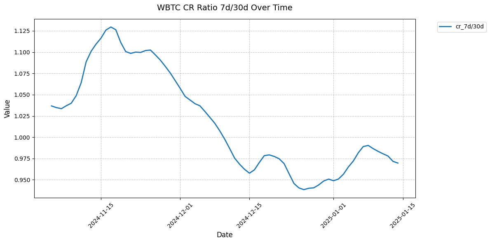

# Methodology for scoring Curve Mint Markets

## Foundation of Market Risk Assessment

### Core Risk Principles

The foundation of our risk assessment methodology centers on two key market participants: lenders and borrowers. Each has distinct risk concerns that must be carefully balanced to ensure market stability.

#### Lender Protection
Lenders primarily need assurance of principal safety. This manifests in two critical ways:
- Protection against losses through efficient liquidation mechanisms
- Ability to exit positions when needed (market liquidity)

While interest rate models play a role in managing liquidity risk through utilization curves, our initial methodology focuses on the more fundamental risk of principal protection.

#### Borrower Protection
Borrowers face a more complex set of risks:
- Liquidation risk from price volatility or oracle inaccuracies
- Rate stability and predictability
- Fair and accurate pricing mechanisms

### Key Risk Factors

These participant needs translate into five fundamental areas that determine market health:

1. **Liquidation Efficiency**
   - Both hard and soft liquidation mechanisms must function smoothly
   - Liquidators need proper incentives and ability to act quickly

2. **Price Accuracy**
   - Oracle prices must reliably reflect market reality
   - Resistance to manipulation attempts
   - Minimal deviation from true market prices

3. **PegKeeper Health**
   - Stable crvUSD peg
   - Adequate PK liquidity
   - Proper rate management

4. **Asset Characteristics**
   - Underlying volatility patterns
   - Price momentum and trends
   - Market depth and liquidity

5. **Market Mechanics**
   - Collateral ratio distributions
   - Position concentration
   - Liquidation thresholds

These factors don't exist in isolation - they interact and amplify each other. A comprehensive scoring system must account for both individual metrics and their interconnected effects on overall market stability.

## Understanding Risk Through Comparative Analysis

The core of our scoring methodology relies on two complementary approaches to measure risk: relative comparisons and benchmark comparisons.

#### Relative & Absolute Approaches

**Relative Comparisons** (30D vs 7D) reveal important trend changes and emerging risks by comparing recent market behavior against its own history. For example, if soft liquidation responsiveness has declined significantly in the past week compared to the monthly average, this could indicate deteriorating market efficiency - even if the absolute values are still within acceptable ranges.

**Benchmark Comparisons** provide essential context by measuring against established standards or theoretical limits. While more qualitative in nature, we constrain these benchmarks to quantitative measures where possible. For instance, comparing current collateral ratios against historically proven safe ranges helps identify when markets drift into riskier territory.

**Why Relative Comparisons Matter**
Relative comparisons act like an early warning system. When a previously stable market shows a 20% increase in soft liquidations over the past week, that trend matters regardless of whether the absolute number is still "acceptable". These comparisons can reveal:
- Deteriorating market conditions before they breach critical thresholds
- Changes in participant behavior or market dynamics
- Emerging risks that might not yet show up in absolute metrics

**Why Benchmark Comparisons Matter**
Benchmark comparisons provide crucial context and boundaries. A market might show stable or even improving relative metrics while operating in dangerous territory. For example:
- A collateral ratio that's been steadily low for weeks might look "fine" in relative terms
- An asset's volatility might be consistently high but show no recent changes
- Critical thresholds exist regardless of recent trends

**The Synergy Between Both**
The real power comes from combining these views:
1. Benchmarks tell us if we're in a safe operating range
2. Relative changes tell us which direction we're heading and how fast
3. Together, they help distinguish between:
   - Temporary fluctuations vs concerning trends
   - Normal market behavior vs potential systemic issues
   - Minor risks vs critical situations requiring intervention

The power of this methodology comes from combining both perspectives. A market might look healthy when measured against benchmarks, but relative comparisons could reveal concerning trends. Conversely, short-term relative changes might appear alarming until placed in broader context through benchmark comparison.

This combined approach is particularly important because risks in one area often amplify risks in others. Consider a scenario where:
1. Relative comparison shows increasing asset volatility (7D vs 30D)
2. Benchmark comparison reveals an above-average concentration of positions in soft liquidation

While each factor alone might be manageable, their combination significantly increases the risk of cascading liquidations. Our scoring system accounts for these interdependencies by adjusting weights and thresholds based on the interplay between different risk factors.

The end result is a more nuanced and reliable risk assessment that captures both immediate market dynamics and longer-term stability factors.

## Risk Indicators

| Indicator | Weight |
|-----------|---------|
| Bad Debt | 14% |
| Debt Ceiling | 14% |
| Collateral Ratio | 11% |
| Collateral Under Soft Liquidation | 11% |
| Volatility Exposure | 11% |
| Borrower Concentration | 9% |
| Price Drop Exposure | 9% |
| Soft Liquidation Efficiency | 9% |
| Interdependency (Volatility) | 6% |
| Interdependency (Price Drop) | 6% |

---

### Scoring Function Analysis

```python
def score_with_limits(score_this: float,
                      upper_limit: float,
                      lower_limit: float,
                      direction: bool,
                      mid_limit: float = None) -> float:
    """
    Score the market based on the collateral ratio comparison

    Args:
        score_this (float): Value to be scored
        upper_limit (float): Upper boundary for scoring
        lower_limit (float): Lower boundary for scoring
        mid_limit (float): Middle point representing 0.5 score
        direction (bool): If True, higher values get higher scores
                        If False, lower values get higher scores

    Returns:
        float: Score between 0 and 1
    """

    if mid_limit is None:
        mid_limit = (upper_limit + lower_limit) / 2

    if direction:
        if score_this >= upper_limit:
            return 1.0
        elif score_this <= lower_limit:
            return 0.0
        else:
            # Score between lower and mid
            if score_this <= mid_limit:
                return 0.5 * (score_this - lower_limit) / (mid_limit - lower_limit)
            # Score between mid and upper
            else:
                return 0.5 + 0.5 * (score_this - mid_limit) / (upper_limit - mid_limit)
    else:
        if score_this >= upper_limit:
            return 0.0
        elif score_this <= lower_limit:
            return 1.0
        else:
            # Score between lower and mid
            if score_this <= mid_limit:
                return 1.0 - 0.5 * (score_this - lower_limit) / (mid_limit - lower_limit)
            # Score between mid and upper
            else:
                return 0.5 - 0.5 * (score_this - mid_limit) / (upper_limit - mid_limit)

    # Ensure score is between 0 and 1
    return max(0.0, min(1.0, score))
```

The `score_with_limits` function implements a piecewise linear scoring system that converts input values into normalized scores between 0 and 1. The function is demonstrated through three different scenarios:


#### Example 1: Higher is Better
```python
score = score_with_limits(
score_this=input_value, # Value to be scored
upper_limit=2.0, # Perfect score threshold
lower_limit=1.0, # Minimum score threshold
direction=True # Higher values are better
)
```

This scenario demonstrates scoring where higher input values are preferred:
- Low (1.0) → Score: 0.00
- Mid (1.5) → Score: 0.50
- High (2.0) → Score: 1.00
- Any value > 2.0 maintains score of 1.00

The function creates a linear progression from lowest score (0.0) at input 1.0 to highest score (1.0) at input 2.0, with values above 2.0 maintaining the maximum score.

#### Example 2: Lower is Better
```python
score = score_with_limits(
score_this=input_value, # Value to be scored
upper_limit=0.8, # Critical threshold
lower_limit=0.0, # Perfect score threshold
direction=False # Lower values are better
)
```

This scenario shows inverse scoring where lower input values are preferred:
- Low (0.0) → Score: 1.00
- Mid (0.4) → Score: 0.50
- High (0.8) → Score: 0.00
- Any value > 0.8 maintains score of 0.00

The scoring decreases linearly from perfect score (1.0) at input 0.0 to minimum score (0.0) at input 0.8.

#### Example 3: With Mid Point
```python
score = score_with_limits(
score_this=input_value, # Value to be scored
upper_limit=2.5, # Upper boundary
lower_limit=0.5, # Lower boundary
direction=False, # Lower values are better
mid_limit=1.0 # Reference point for 0.50 score
)
```

This scenario demonstrates scoring with a defined midpoint, creating two different slopes:
- Low (0.5) → Score: 1.00
- Mid (1.0) → Score: 0.50
- High (2.5) → Score: 0.00

The scoring has different rates of change below and above the midpoint (1.0), allowing for more nuanced evaluation.

#### Key Features

1. **Linear Interpolation**:
   - Smooth, predictable scoring between threshold points
   - Different slopes possible before and after midpoint

2. **Configurable Parameters**:
   - Direction: Can handle both "higher is better" and "lower is better" scenarios
   - Thresholds: Customizable upper and lower limits
   - Optional midpoint: Allows for asymmetric scoring ranges

3. **Bounded Results**:
   - All scores normalized between 0 and 1
   - Clear saturation points at upper and lower thresholds

### Bad Debt | Weight 14%

The bad debt scoring system evaluates the health of Curve lending markets by analyzing the ratio of bad debt to total debt. It implements a quadratic scoring model that provides a normalized score between 0 and 1, where 1 represents optimal health (minimal/no bad debt) and 0 represents critical levels of bad debt.

#### Main Scoring Function
```python
def score_bad_debt(bad_debt: float, current_debt: float, method: str = 'quadratic_balanced') -> float:
    """
    Calculates a risk score based on the ratio of bad debt to total current debt.
    
    Parameters:
        bad_debt (float): Total amount of bad debt in the market
        current_debt (float): Total current debt in the market
        method (str): Interpolation method for scoring curve (default: 'quadratic_balanced')
    
    Returns:
        float: Score between 0 (high risk) and 1 (low risk)
    
    Thresholds:
        - Ignore threshold: 0.1% of current debt (score = 1.0)
        - Critical threshold: 1.0% of current debt (score = 0.0)
        - Scores between thresholds use quadratic interpolation
    """
```

#### Key Features

1. **Threshold-Based Scoring**:
   - Ignore Threshold (0.1%): Bad debt below this level receives a perfect score (1.0)
   - Critical Threshold (1.0%): Bad debt above this level receives minimum score (0.0)
   - Intermediate values are scored using quadratic interpolation

2. **Quadratic Interpolation**:
   - Uses a balanced quadratic curve for smooth transitions between thresholds
   - Formula: `score = 1 - x * x * x` where x is normalized bad debt ratio
   - Provides more nuanced scoring for values between thresholds

3. **Visualization Support**:
   - Includes plotting function to visualize scoring curves
   - Helps in understanding scoring behavior across different debt ratios

#### Implementation Details

1. **Ratio Calculation**:
   ```python
   bad_debt_ratio = bad_debt / current_debt if current_debt > 0 else 0
   ```

2. **Threshold Checks**:
   ```python
   if bad_debt_ratio <= IGNORE_THRESHOLD:  # 0.1%
       return 1.0
   if bad_debt_ratio >= CRITICAL_THRESHOLD:  # 1.0%
       return 0.0
   ```

3. **Score Normalization**:
   ```python
   x = (bad_debt_ratio - IGNORE_THRESHOLD) / (CRITICAL_THRESHOLD - IGNORE_THRESHOLD)
   ```

---

### Debt Ceiling | Weight 14%

The debt ceiling scoring system evaluates the efficiency of Curve lending markets by comparing recommended debt ceilings against current market capacity. It implements a linear scoring model that provides a normalized score between 0 and 1, where 1 represents optimal utilization and 0 represents significant overcapacity.

#### Main Scoring Function
```python
def score_debt_ceiling(recommended_debt_ceiling: float, current_debt_ceiling: float, current_debt: float) -> float:
    """
    Calculates a risk score based on the ratio of recommended ceiling to current ceiling.
    
    Parameters:
        recommended_debt_ceiling (float): Recommended maximum debt ceiling
        current_debt_ceiling (float): Current total debt ceiling (total_debt + borrowable)
        current_debt (float): Current total debt in the market
    
    Returns:
        float: Score between 0 (high risk) and 1 (low risk)
    
    Scoring Logic:
        - If current ceiling <= recommended: Perfect score (1.0)
        - If current debt <= recommended: Score between 0.5 and 1.0
        - If current debt > recommended: Minimum score (0.0)
    """
```

#### Key Features

1. **Tiered Scoring System**:
   - Perfect Score (1.0): Current ceiling at or below recommendations
   - Partial Score (0.5-1.0): Current debt below recommendations
   - Zero Score (0.0): Current debt exceeds recommendations

2. **Linear Interpolation**:
   - Uses linear scaling between 0.5 and 1.0 for partial scores
   - Formula: `score = 0.5 + 0.5 * ((recommended - current_debt) / recommended)`
   - Provides proportional scoring for acceptable debt levels

#### Implementation Details

1. **Basic Threshold Check**:
   ```python
   if current_debt_ceiling <= recommended_debt_ceiling:
       return 1.0
   ```

2. **Debt Level Assessment**:
   ```python
   elif current_debt <= recommended_debt_ceiling:
       return 0.5 + 0.5 * ((recommended_debt_ceiling - current_debt) / recommended_debt_ceiling)
   ```

3. **Critical Level Check**:
   ```python
   else:
       return 0.0
   ```

---

### Collateral Ratio | Weight 11%

The Collateral Ratio scoring system evaluates market health by analyzing both current collateralization levels and their stability over time. It combines relative (temporal) and absolute (threshold-based) metrics to provide a comprehensive risk assessment.

#### Main Scoring Function
```python
def score_with_limits(score_this: float, upper_limit: float, lower_limit: float, 
                     direction: bool = True, mid_limit: float = None) -> float:
    """
    Calculates a normalized score based on value position within defined limits.
    
    Parameters:
        score_this (float): Value to score
        upper_limit (float): Upper boundary for scoring
        lower_limit (float): Lower boundary for scoring
        direction (bool): True if higher values are better, False if lower are better
        mid_limit (float): Middle point representing 0.5 score (optional)
    
    Returns:
        float: Score between 0 (high risk) and 1 (low risk)
    """
```

#### Key Features

1. **Dual Scoring Components**:
   - Relative Score (40%): Evaluates CR stability using 7d/30d ratio
   - Absolute Score (60%): Compares current CR against LTV limits
   - Final Score: Weighted average of both components

2. **LTV Range Analysis**:
   - Min LTV: 69.0% (Conservative bound)
   - Max LTV: 92.0% (Risk bound)
   - Safety Margin: 25% buffer on bounds
   - Corresponding CR Ranges: 144.9% - 108.7%. The bounds after applying the safety margin are 193.2% - 144.9%.

3. **Scoring Thresholds**:
   - Relative: 0.9 (lower) to 1.1 (upper) for 7d/30d ratio
   - Absolute: Based on LTV-derived CR limits with safety margin
   - Linear interpolation between thresholds

#### Implementation Details

1. **Relative CR Scoring**:
   ```python
   relative_cr_score = score_with_limits(
       cr_7d_30d_ratio,  # Current 7d/30d CR ratio
       1.1,              # Upper threshold (110%)
       0.9,              # Lower threshold (90%)
       True              # Higher values preferred
   )
   ```

2. **Absolute CR Scoring**:
   ```python
   absolute_cr_score = score_with_limits(
       current_cr,
       1/(0.75 * min_ltv),  # Upper CR threshold with safety margin
       1/(0.75 * max_ltv),  # Lower CR threshold with safety margin
       True                 # Higher values preferred
   )
   ```

3. **Final Score Calculation**:
   ```python
   final_score = 0.4 * relative_cr_score + 0.6 * absolute_cr_score
   ```

#### Appendix





---

### Collateral Under Soft Liquidation | Weight 11%

Since each user will go through soft liquidation before being liquidated, collateral under soft liquidation will give us an idea of how much collateral is at risk of being pushed towards liquidation. This uses the same scoring function as the Collateral Ratio and has a similar scoring logic (relative comparison and absolute comparison).

It's the sum of collateral for all users under sl / total collateral. 

#### Scoring Components

1. **Absolute Score (40%)**:
   - Evaluates the current percentage of collateral under soft liquidation
   - Thresholds:
     - Score is 1.0 if no collateral is under soft liquidation
     - Score is 0.0 if 80% or more collateral is under soft liquidation
     - Linear interpolation between thresholds

2. **Relative Score (60%)**:
   - Compares 7-day vs 30-day average of collateral under soft liquidation with a ratio of 7D/30D
   - Helps identify worsening trends
   ```python
   rel_score = score_with_limits(
       ratio_7d_30d,  # 7d/30d ratio
       2.5,           # Upper threshold (250%)
       0.5,           # Lower threshold (50%)
       False,         # Lower values preferred
       1.0            # Midpoint (100%)
   )
   ```
   - Thresholds:
     - Score is 1.0 if recent average is significantly lower 50% than historical
     - Score is 0.5 if recent matches historical (ratio = 1.0)
     - Score is 0.0 if recent is 2.5x higher than historical

3. **Final Score Calculation**:
   - Weights relative comparison more heavily (60%) to emphasize trends
   - Absolute levels still important (40%) for overall health assessment


#### Sample Analysis (March 2024)
```
Market   |  Current % |     7d Avg |    30d Avg |     7d/30d |  Abs Score |  Rel Score |    Final
-----------------------------------------------------------------------------------------------
sfrxETH  |      0.00% |      0.00% |      0.00% |       1.00 |    100.00% |     50.00% |   70.00%
wstETH   |      0.00% |      0.00% |     27.50% |       0.00 |    100.00% |    100.00% |  100.00%
WBTC     |      7.72% |      9.66% |     11.47% |       0.84 |     90.35% |     65.79% |   75.61%
WETH     |      1.53% |      5.25% |      7.48% |       0.70 |     98.09% |     79.79% |   87.11%
tBTC     |      0.00% |      0.00% |      0.00% |       1.00 |    100.00% |     50.00% |   70.00%
```

### Volatility Exposure | Weight 11%

The Volatility Exposure scoring system evaluates market risk through two components: relative volatility changes and Bitcoin correlation. It uses the Garman-Klass volatility estimator and provides a normalized score between 0 and 1, where 1 represents stable volatility patterns and 0 represents concerning volatility exposure.

#### Volatility Calculation
The system uses a modified Garman-Klass volatility estimator that leverages OHLC (Open-High-Low-Close) data for more efficient volatility estimates:

$σ² = 0.5[ln(\frac{High}{Low} )]² - (2ln(2)-1)[ln(\frac{Close}{Open} )]²$

#### Key Components

1. **Volatility Ratio Scoring | Relative Comparison**:
   - Compares 45-day vs 180-day volatility windows
   - `vol_ratio = vol_45d/vol_180d`
   ```python
   vol_ratio_score = score_with_limits(vol_ratio, 1.5, 0.75, False)
   ```
   - Score is 0 if recent volatility (45d) exceeds 1.5x the historical volatility (180d)
   - Score is 1 if ratio is below 0.75x

2. **Beta Scoring | Benchmark Comparison**:
   - Measures correlation with BTC price movements
   - Beta calculation:
   ```python
   beta = correlation * (asset_vol / btc_vol)
   ```
   - Both `asset_vol` and `btc_vol` use the Garman-Klass method
   - Beta scoring:
   ```python
   beta_score = score_with_limits(beta, 2.5, 0.5, False, 1)
   ```
   - Score is 0.5 at beta = 1.0
   - Score is 0 if beta exceeds 2.5

3. **Final Score Calculation**:
   ```python
   aggregate_vol_score = (0.4 * vol_ratio_score + 0.6 * beta_score)
   ```
   - Volatility ratio contributes 40%
   - Beta score contributes 60%

#### Sample Analysis (WBTC)
```
Volatility Windows:
  45-day vol:  32%
  180-day vol: 28%
  Ratio:       1.14
  Vol Score:   0.72

Beta Analysis:
  Asset Vol:   32%
  BTC Vol:     28%
  Correlation: 0.95
  Beta:        1.09
  Beta Score:  0.45

Final Score:   0.56
```

This scoring approach combines both temporal volatility changes and BTC correlation to provide a comprehensive risk assessment. The Garman-Klass estimator provides more accurate volatility measurements by incorporating high-low ranges, while the beta component helps assess systematic market risk exposure.

### Borrower Concentration | Weight 9%

The Borrower Concentration scoring system evaluates the distribution of debt across borrowers using the Herfindahl-Hirschman Index (HHI). It provides a normalized score between 0 and 1, where 1 represents well-distributed borrowing and 0 represents concerning concentration levels. High concentration of debt among a few borrowers can pose systemic risks to the lending market, as the default of a major borrower could significantly impact the protocol's stability.

The HHI, originally developed for measuring market concentration in industries, is particularly suitable for assessing borrower distribution because it:
- Gives more weight to larger debt positions by squaring individual shares
- Has a known minimum value when debt is perfectly distributed
- Increases non-linearly as concentration increases
- Provides a single metric that can be tracked over time

For example, if a market has $10M in total debt:

**Scenario 1: Equal Distribution** (10 users with $1M each)
```python
HHI = (1M)² + (1M)² + ... + (1M)² (10 times)
    = 10 * (1M)²
    = 10 * (1e6)²
    = 1e13

HHI_ideal = (10M)² / 10
         = (1e7)² / 10
         = 1e13

HHI_ratio = 1e13 / 1e13 = 1.0  # Perfect distribution
```

**Scenario 2: Concentrated** (1 user with $9M, 9 users with $100K each)
```python
HHI = (9M)² + (0.1M)² + ... + (0.1M)² (9 times)
    = 81e12 + 9 * (0.1e6)²
    = 81e12 + 9 * 1e10
    = 81.09e12

HHI_ideal = (10M)² / 10
         = (1e7)² / 10
         = 1e13

HHI_ratio = 81.09e12 / 1e13 = 8.109  # High concentration
```

In Scenario 2, the HHI ratio is almost 8.109x the ideal value, indicating significant concentration risk.

#### HHI Calculation
The system uses the Herfindahl-Hirschman Index to measure market concentration:

$HHI = \sum_{i=1}^{n} (debt_i)^2$

$HHI_{ideal} = \frac{(total\_debt)^2}{n\_loans}$

$HHI_{ratio} = \frac{HHI}{HHI_{ideal}}$

#### Key Components

#### Scoring Components

1. **Relative Distribution Scoring (50%)**:
   - Compares recent (7-day) vs historical (30-day) concentration trends
   - Helps identify sudden changes in borrower distribution
   - Calculation:
   ```python
   hhi_7d_30d_ratio = hhi_7d / hhi_30d
   relative_borrower_distribution_score = score_with_limits(
       hhi_7d_30d_ratio,  # Recent/Historical HHI ratio
       1.1,               # Upper threshold (110%)
       0.9,               # Lower threshold (90%)
       True               # Higher values preferred
   )
   ```
   - Score interpretation:
     - 1.0: Recent distribution similar to or better than historical
     - 0.5: 10% deviation from historical pattern
     - 0.0: Recent concentration >10% worse than historical

2. **Absolute Distribution Scoring (50%)**:
   - Compares current HHI ratio against ideal thresholds
   - Measures how far current distribution deviates from perfect equality
   - Calculation:
   ```python
   benchmark_borrower_distribution_score = score_with_limits(
       last_row["hhi_ratio"],  # Current HHI ratio
       10,                     # Upper threshold (10x ideal)
       30,                     # Lower threshold (30x ideal)
       True                    # Higher values preferred
   )
   ```
   - Score interpretation:
     - 1.0: Distribution close to ideal (HHI ratio ≤ 10x)
     - 0.5: Moderate concentration (HHI ratio = 20x)
     - 0.0: High concentration (HHI ratio ≥ 30x)

The dual scoring approach provides both:
- Short-term stability monitoring (relative score)
- Long-term health assessment (absolute score)

#### Sample Analysis (WETH Market)
```
HHI Analysis:
  Current HHI:     5.2e9
  Ideal HHI:       3.1e8
  HHI Ratio:       16.7x
  Benchmark Score: 0.66

Relative Analysis:
  7-day HHI:       5.2e9
  30-day HHI:      4.9e9
  Ratio:           1.06
  Relative Score:  0.70

Final Score:       0.68
```

This scoring approach combines both temporal changes in borrower concentration and comparison against ideal distribution. The HHI provides a standardized way to measure concentration, while the dual scoring components help identify both sudden changes and sustained concentration issues.

### Price Drop Exposure | Weight 9%

The Price Drop Exposure scoring system evaluates the risk of significant price declines in collateral assets by analyzing historical price movements. It implements a dual-threshold scoring model that provides a normalized score between 0 and 1, where 1 represents minimal price drop risk and 0 represents critical likelihood of price declines.

#### Key Features

1. **Dual Drop Thresholds**:
   - Moderate Drop (7.5%): Assesses risk of 7.5% drop in price
   - Severe Drop (15%): Assesses risk of 15% drop in price
   - Equal weighting (50/50) between both scenarios

2. **Probability Scoring**:
   - Uses historical data (180-day window)
   - Linear scoring between 0% and critical thresholds
   - Fixed thresholds to separate from volatility assessment

3. **Risk Boundaries**:
   - 7.5% Drop: 0% to 3% probability range
   - 15% Drop: 0% to 0.75% probability range
   - Scores saturate at boundaries

#### Implementation Details

1. **7.5% Drop Scoring**:
   ```python
   prob_drop1_score = score_with_limits(
       prob_drop1,    # Probability of 7.5% drop
       0.03,          # Critical threshold (3%)
       0.00,          # Perfect score threshold
       False          # Lower probabilities are better
   )
   ```

2. **15% Drop Scoring**:
   ```python
   prob_drop2_score = score_with_limits(
       prob_drop2,    # Probability of 15% drop
       0.0075,        # Critical threshold (0.75%)
       0.00,          # Perfect score threshold
       False          # Lower probabilities are better
   )
   ```

3. **Final Score Calculation**:
   ```python
   aggregate_prob_drop_score = 0.5 * prob_drop1_score + 0.5 * prob_drop2_score
   ```

#### Sample Analysis (WBTC)
```
7.5% Drop:
  Probability: 1.2%
  Score:      0.60

15% Drop:
  Probability: 0.3%
  Score:      0.60

Final Score:  0.60
```

This scoring approach helps identify assets with concerning price drop tendencies while maintaining independence from general volatility measures. The fixed thresholds provide clear risk boundaries, while the dual-threshold approach captures both moderate and severe market stress scenarios.

### Soft Liquidation Efficiency | Weight 9%

Estimating the exact gains from soft liquidation is a complex task. Also classifying arbitrageurs (who targeting gains from soft liquidations) from dex aggregators is difficult. Instead we can use the price deviation of amm price from the oracle price to estimate the opportunity for arbitrageurs. This price deviation coupled with the swappable collateral can be a good proxy to determine the arb opportunity.


The red scatter in the above chart shows the swap events. The chart also shows the oracle price and the amm price. The price deviation is the difference between the oracle price and the amm price. It even shows the active band and the composition through the time.

Here the deviation is the difference (not absolute) between the oracle price and the amm price. This deviation is multiplied by the swappable collateral value denominated in crvUSD. This product is used as a proxy for the arbitrage opportunity.

Using this product for n blocks, we construct a distribution of the arbitrage opportunity. This distribution is compared against a relatively larger time window distribution. The distribution peak is supposed to be near 0, the narrower the distribution near 0, the better the market is performing in term sof incentivizing the soft liquidations. The comparisons are made on two fronts:

1. **Distribution spread comparison** 
2. **Distribution peak comparison** 


Here is a sample comparison of 90D vs 7D distribution. 

#### Scoring Components

1. **Distribution Spread Analysis (50%)**:
   - Measures how tightly clustered the arbitrage opportunities are
   - Uses three statistical measures:
     ```python
     spread_metrics = {
         'std': Standard deviation of opportunities
         'iqr': Interquartile range
         'range': Total range (max - min)
     }
     ```
   - Each metric provides different insights:
     - StdDev: Overall variability of opportunities
     - IQR: Spread of middle 50% of opportunities
     - Range: Maximum spread of opportunities
   - Scoring formula:
     ```python
     def spread_ratio_score(test_val, ref_val):
         ratio = test_val / ref_val
         if ratio <= 1:  
             # Tighter spread than reference (good)
             return 50 + (50 * (1 - ratio))  # Score: 50-100
         else:  
             # Wider spread than reference (bad)
             return max(0, 50 * (25 - ratio) / 24)  # Score: 0-50
     ```
   - Example:
     ```
     Reference Spread:  $1000
     Current Spread:    $800
     Ratio:            0.8
     Spread Score:     60  # Better than reference
     ```

2. **Peak Location Analysis (50%)**:
   - Measures how close the distribution peak is to zero
   - Uses Gaussian KDE to find distribution peaks
   - Scoring process:
     1. Find peak of reference distribution
     2. Find peak of test distribution
     3. Calculate difference in standard deviation units
     4. Apply exponential decay scoring
   - Scoring formula:
     ```python
     peak_diff_in_stds = |test_peak - ref_peak| / ref_std
     peak_score = 100 * exp(-peak_diff_in_stds * 5)
     ```
   - Example:
     ```
     Reference Peak:    $0
     Current Peak:      $50
     Reference StdDev:  $100
     Peak Difference:   0.5 std deviations
     Peak Score:        8.21  # exp(-0.5 * 5) * 100
     ```

3. **Final Score Calculation**:
   ```python
   overall_score = (spread_score + peak_score) / 2
   ```
The dual scoring approach helps identify different types of inefficiencies:
- High spread score + Low peak score: Consistent but biased opportunities
- Low spread score + High peak score: Centered but inconsistent opportunities
- Low scores in both: Generally inefficient market
- High scores in both: Optimal soft liquidation mechanics


The scoring system rewards:
1. Tight clustering of deviation * swappable collateral (spread score)
2. Deviation * swappable collateral centered near zero (peak score)
3. Consistency with historical patterns (reference comparison)

A high score indicates efficient soft liquidation mechanics where:
- Arbitrage opportunities are quickly taken
- Price deviations are minimal
- Market behavior is stable and predictable

### Interdependency (Volatility) | Weight 6%

### Interdependency (Price Drop) | Weight 6%

---

:::info
**Logic behind the weights**
- It was identified that scores in certain area impact and influence other area too i.e. interdependencies. To address these interdependencies originating from volatile movements and price momentum, we derived the metric $K$ and $L$.
- The current bad debt is not a direct reason for future bad debt (if occurs). This is the reason it has less weight.
- For this initial version of scoring weights, we try to give almost equal weightage to every dimension.
- **All the categories will be scored between 0 and 1, 0 being the risk end of the spectrum and 1 being the safu end of spectrum**.
:::

## Background & Fundamentals

### What matters?

#### Lender
> Lender is assumed to withstand the volatility risk associated with the supplied assets.  
- Lenders' safuness depends on:
    - the ability to withdraw the principal without losses i.e. no bad debt. For this we need to ensure the liquidations are happening efficiently.
    - the ability to withdraw the principal at any time i.e. super high utilization will cause lenders to be trapped. This is handled by the interest rate curves. This can be safely ignored for the initial version of scoring methodology. Once we start working on the interest rate models this becomes relevant.

#### Borrower
> Borrower is assumed to be afraid of liquidations.

- Borrowers' safuness depends on:
    - stable and predictable rates. This translates to the crvUSD price trend compared to its peg ($1). This point is relevant for the borrowers in the mint markets. To address this we need to check the PK health. 
    - borrowed asset's price trend and volatility. High volatility can cause the position to deteriorate if it is under SL. 
    - borrowed asset's oracle price and the occurrence of miss pricing, price deviations. Borrowers don't want false liquidations and false oracle price can cause this.

### What to score and how?

- Everything boils down to ensure the following:
    - Efficient liquidations (HL and SL)
    - Accurate pricing
    - Hard to manipulate the prices
    - Healthy PKs
    - Supplied asset's price movements and volatility
- Above areas can be scored based on some kind of comparison (a benchmark or comparing with historic performance). This leads to two type of comparisons that we can derive to come up with a score:
    - **Benchmark comparison** - This has a qualitative flavor but we can try limiting the benchmark to quantitative.  
    - **Relative comparison** - This is a direct comparison between the market's historic performance vs recent performance (30D vs 7D).
- While scoring, a score in a particular area may influence the extent of risk on other areas. For example, if the majority positions are under SL and supply asset is being volatile lately, this imposes a lot of risk, both on the lenders as well as the borrowers.

## Detailed explaination on the Scoring Dimensions

### A - Price Drop Probability

This measures the tendency of the price movements of the collateral asset. We measure, using the historic data, the probability of price dropping by 7.5% and 15%. Based on what probabilities we get, we score this category.

It was intentional to fixate the drop limits at 7.5% and 15%. If we were to make them dynamic with respect to the volatility of the subjected asset, we would have covered the volatility category as well which we intend to cover seperately.

The way we score this is as follows:

We define the value that needs to be scored called $x$ here. We specify the limits (upper and lower) for which the score could either by 0 or 1 (determined by the input direction). 

Following mathematical formula assumes a direction where higher value = better score.

```
Score = 
  if x ≤ lower_limit:          0.0
  if lower_limit < x ≤ mid:    0.5 * (x - lower) / (mid - lower)
  if mid < x < upper_limit:    0.5 + 0.5 * (x - mid) / (upper - mid)
  if x ≥ upper_limit:          1.0
```

We derive two score form here: `drop1_score` & `drop2_score`

```python
drop1_score = score_with_limits(x,0.03,0,False)
drop2_score = score_with_limits(x,0.0075,0,False)
aggregate_drop_score = (0.5*drop1_score + 0.5*drop2_score)
```

If there is an asset with a 7.5% price drop probability in a single day is of > 3%, it would be scored as 0 (the direction, higher value = better score is set to false). Similarly, if the 15% price drop probability in a single day is of > 0.75%, it would be scored as 0.

`aggregate_drop_score` is the overall score for this category.

:::success
**Future Improvements**

Research Laplace Distribution Fit and derive an ideal price behavior from which limits of 7.5% and 15% drop can be adjusted.

:::

### B - Volatility & Beta w.r.t BTC 

It is assumed that BTC price volatility is a proxy for baseline. We derive two scores here similar to $A$ and then we aggregate it to a single score.

We do a relative comparison of past volatility and recent volatility. 
The function implements a modified Garman-Klass volatility estimator across two different time windows (45-day and 180-day) to measure volatility regime changes in market prices. The estimator uses OHLC (Open-High-Low-Close) data to compute a more efficient volatility estimate than simple close-to-close methods:

$σ² = 0.5[ln(\frac{High}{Low} )]² - (2ln(2)-1)[ln(\frac{Close}{Open} )]²$

Using the above formula, we compute Garman-Klass volatility for 45D and 120D and get a ratio out of it. `vol_ratio` = `vol_45d`/`vol_180d`

This `vol_ratio` is then scored as follows:

```python
vol_ratio_score = score_with_limits(vol_ratio,1.5,0.75,False)
```

Meaning if the vol_45d which is a proxy for recent volatility is > 1.5x the past volatility, it will be scored 0.

Next we compute the $β$ of the subjected asset with respect to BTC price. It is computed as follows:

```python
beta = correlation * (asset_vol / btc_vol)
```

`asset_vol` and `btc_vol` are computed in the same way as discussed above and they follow the Garman-Klass volatility method.

This `vol_ratio` is then scored as follows:

```python
beta_score = score_with_limits(beta,2.5,0.5,False,1)
```

Meaning if the `beta` comea out at 1, the score would be 0.5 and if `beta` exceeds beyind 2.5, the score goes to 0.

```python
aggregate_vol_score = (0.4*vol_ratio_score + 0.6*beta_score)

```
`aggregate_vol_score` is the overall score for this category. 

:::success
**Future Improvements**

- Research if BTC is a good proxy for baseline.
- Research the weights for `aggregate_vol_score`
:::

### C - Debt Ceiling

Check the function for details

```python
def score_debt_ceiling(recommended_debt_ceiling: float,
                       current_debt_ceiling: float,
                       current_debt: float) -> float:
    
    # Assume recommended_debt_ceiling, current_debt_ceiling & current_debt are +ve
    
    # Safe score if current_debt_ceiling <= recommended_debt_ceiling
    if current_debt_ceiling <= recommended_debt_ceiling:
        return 1.0 # Safe
    
    # current_debt_ceiling > recommended_debt_ceiling >= current_debt
    elif current_debt <= recommended_debt_ceiling:
        # score between 0.5 and 1
        return 0.5 + 0.5 * (current_debt / recommended_debt_ceiling)
    
    # Unsafe/Risky if current_debt > recommended_debt_ceiling
    else:
        return 0.0 # Risky
```

### D - Market Bad Debt	

Check the function for details

```python
def score_bad_debt(bad_debt: float,
                   current_debt: float) -> float:
    
    # Assume bad_debt & current_debt are +ve
        
    # No bad debt
    if bad_debt == 0:
        return 1.0
    
    # 0 < Existing bad debt < 0.1% of current_debt
    elif bad_debt < 0.001 * current_debt:
        # score between 0.5 and 1
        return 0.5 + 0.5 * (bad_debt / (0.001 * current_debt))
    
    # 0.1% of current_debt <= Existing bad debt < 1% of current_debt
    elif bad_debt < 0.01 * current_debt:
        # score between 0 and 0.5
        return 0.5 * (bad_debt / (0.01 * current_debt))
    
    # Existing bad debt >= 1% of current_debt
    else:
        return 0.0
```

### E - Market Collateral Ratio

Benchmark comparison as well as Relative comparison makes sense here. 

Benchmark comparison might need a specific research related to the subjected market but can be conservative assumption to start with and further research can be done for future version. For start, we use the 75% of the max allowed ltv and min allowed ltv as a range that can be used as a proxy for this benchmark comparison.

Comparison between the 30D average CR vs the 7D average CR is a good way to spot the trend and score the user behavior and market condition accordingly.

```python
relative_cr_score = score_with_limits(relative_cr_ratio,1.1,0.9,True)
        
absolute_cr_score = score_with_limits(current_ltv,0.75*max_ltv,0.75*min_ltv,False)
        
aggregate_cr_score = (0.4*relative_cr_score + 0.6*absolute_cr_score)
```

Here `relative_cr_ratio` = 7D rolling average CR / 30D rolling average CR. If 7D rolling average CR is > 110% of the 30D rolling average CR, the score is 1 (safe) and if 7D rolling average CR is < 90% of the the 30D rolling average CR, the score is 0.

`aggregate_cr_score` is the overall score for this category. 

### F - Average Arb Profit Trajectory
Waiting for endpoint

### G - Responsiveness of arb traders in SL
Waiting for endpoint

### H - % of Loans in SL Relative to average
WIP - Implemented but not yet documented

### I - Borrower Concentration
WIP - Experimenting with Herfindahl-Hirschman Index


~~### J Borrower Concentration SL~~
